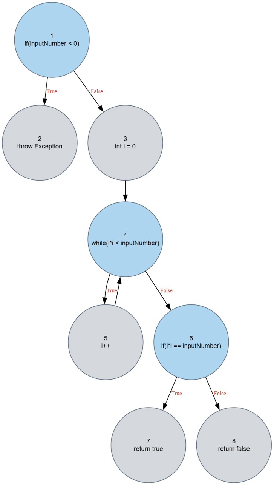
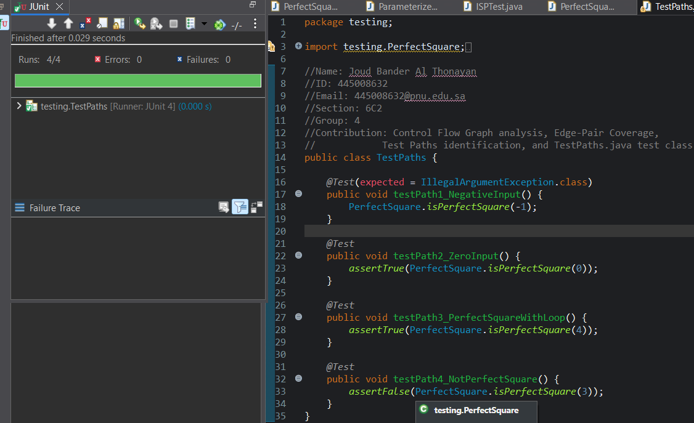
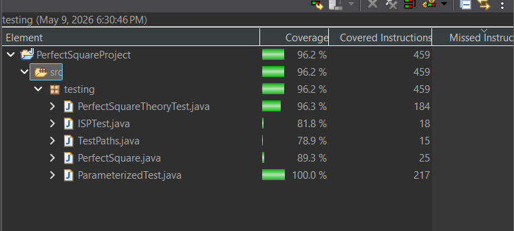

# Software Testing — Advanced JUnit Techniques

Applying formal software testing methodologies to a small Java function, verified with measured code coverage.

Built as a team project for a university Software Testing course (CS386T).

## Overview

This project applies a full toolkit of formal software testing techniques to a Java function that checks whether a number is a perfect square: deriving a Control Flow Graph, identifying test paths through Edge-Pair Coverage, writing parameterized and theory-based JUnit tests, partitioning the input space, and measuring the result with a code coverage tool.

## Techniques applied

**Control Flow Graph & Edge-Pair Coverage** — mapped the function's 8 nodes and 8 edges, derived 9 edge-pair coverage requirements, and picked 4 test paths that satisfy all of them.

**JUnit Parameterized Tests** — one test method run against 13 different input/expected-output pairs instead of writing a separate test per case.

**JUnit Theories** — general rules (e.g. "any perfect square must return true") checked against pools of data points, rather than one hardcoded assertion per value.

**Input Space Partitioning (ISP)** — input space split into characteristics (sign of input, nature of its square root) and blocks, with one representative test per block.

## Code coverage (measured with Clover)

| Test class | Coverage |
|---|---|
| ParameterizedTest.java | 100% |
| PerfectSquareTheoryTest.java | 96.3% |
| TestPaths.java | 78.9% |
| ISPTest.java | 78.9% |
| **Overall** | **96.2%** |

## Tech stack

Java, JUnit 4 (including the Theories runner), Eclipse, Clover for code coverage.

## Author

Joud Al Thonayan
Computer Science student, Princess Nourah University
[LinkedIn](https://www.linkedin.com/in/joud-al-thonayan-bb126a431) • [GitHub](https://github.com/JoudBander)
